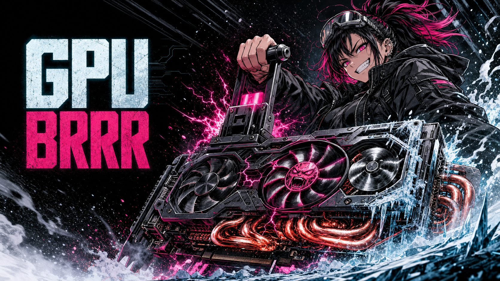

# GPU Brrr

<p align="center">
  
</p>

*Make the GPU go brrr — but measure first.*

Coding agents love to "optimize" GPU code by reflex: reach for `torch.compile`,
suggest a bigger GPU, sprinkle in mixed precision, rewrite a loop in C++. Most of that
advice is aimed at the wrong bottleneck. **GPU Brrr** is an Agent Skill that forces the
agent to diagnose *why* a deep learning workload is slow before it changes a line:
measure a baseline, classify the regime, change one variable, verify correctness, and
report before/after evidence.

The model comes from Horace He's
[Making Deep Learning Go Brrrr From First Principles](https://horace.io/brrr_intro.html):
accelerator time is spent on **compute**, **memory traffic**, or **overhead**, and the
right fix depends entirely on which one dominates.

## Why it matters

Without a diagnosis, common advice is often actively wrong:

- A faster GPU does not fix a memory-bandwidth-bound pointwise chain.
- Rewriting Python does not speed up a saturated matrix multiplication.
- Low achieved FLOPS alone does not prove a bandwidth bottleneck.
- Activation checkpointing usually *saves memory by recomputing* and can be slower.
- `torch.compile` can lose its gains to graph breaks, recompilation, or cold-start cost.

The skill refuses to recommend a fix until it has evidence: benchmark protocol, profiler
observations, regime + confidence, one intervention, correctness checks, and
before/after metrics.

## How it works

Before touching code, the agent walks a diagnostic ladder and stops at the first step
that answers the question:

```
0. Define the metric + baseline   → latency / throughput / step time, warmed up, synced
1. Batch-size / size test          → does runtime scale with data?  no ⇒ overhead hypothesis
2. Achieved vs peak FLOPS          → high ⇒ compute-bound; low ⇒ inconclusive, keep going
3. Profiler + counters             → PyTorch profiler / Nsight; DRAM vs compute pipeline
4. Change one thing, prove it      → re-run identical benchmark, check correctness
```

Regime → fix, and nothing else:

| Regime | Matching fixes |
|--------|----------------|
| **Overhead-bound** | `torch.compile` / graph capture, CUDA Graphs, fusion, larger batch, move hot paths out of Python |
| **Bandwidth-bound** | operator fusion, fewer/larger kernels, mixed precision, custom Triton kernels (activation checkpointing only conditionally — it trades compute for memory and must be measured, it is not a default speedup) |
| **Compute-bound** | Tensor Cores (shapes ×8/16), lower precision (bf16/fp16/fp8), better tiling, cheaper algorithm, more hardware |

## Try these prompts

```text
My PyTorch training loop sits at 35% GPU-Util. Profile it and identify the bottleneck
before changing code. Return the diagnostic report and a measured patch.
```

```text
This inference service got slower after torch.compile. Separate cold-start from
steady-state latency, inspect graph breaks/recompiles, and keep only proven changes.
```

```text
Is this attention block compute-bound, bandwidth-bound, or overhead-bound?
Do not infer bandwidth from low FLOPS alone.
```

## What's inside

```text
skills/gpu-brrr/
├── SKILL.md
└── references/
    ├── diagnostic-report.md      required evidence + reporting template
    ├── flop-counting.md          counting FLOPs, measuring achieved-vs-peak FLOPS
    ├── optimization-recipes.md   concrete PyTorch/Triton patterns per regime
    ├── profiling.md              PyTorch profiler, nvidia-smi, Nsight, traces
    └── roofline.md               roofline model + worked bandwidth-vs-compute math
```

## Install

There are two ways to install: **copy the native skill** (works with any Agent
Skills-compatible client) or the **optional Claude Code plugin marketplace** (Claude Code
only, adds one-command install/update). They are independent — pick whichever fits your
client.

### Claude Code

**Option A — native skill copy** (no marketplace):

```bash
# user-level: available in every project
mkdir -p ~/.claude/skills
cp -R skills/gpu-brrr ~/.claude/skills/

# or project-local: scoped to one repo
mkdir -p .claude/skills
cp -R skills/gpu-brrr .claude/skills/
```

**Option B — plugin marketplace** (optional, one-command install + updates). This repo
ships a marketplace manifest at [`.claude-plugin/marketplace.json`](.claude-plugin/marketplace.json)
and a plugin manifest at [`.claude-plugin/plugin.json`](.claude-plugin/plugin.json). From
inside Claude Code:

```text
/plugin marketplace add OWNER/REPOSITORY
```

```text
/plugin install gpu-brrr@gpu-brrr
```

The install identifier is `gpu-brrr@gpu-brrr` — `<plugin-name>@<marketplace-name>`, both
defined in the manifests above. Replace `OWNER/REPOSITORY` with this repo's GitHub path.

### OpenCode

Project-local:

```bash
mkdir -p .opencode/skills
cp -R skills/gpu-brrr .opencode/skills/
```

Global:

```bash
mkdir -p ~/.config/opencode/skills
cp -R skills/gpu-brrr ~/.config/opencode/skills/
```

OpenCode also discovers Agent Skills under `.agents/skills/` and `~/.agents/skills/`. See
the [OpenCode skill documentation](https://opencode.ai/docs/skills/).

### Hermes Agent

Install directly from a published repository:

```bash
hermes skills install OWNER/REPOSITORY/skills/gpu-brrr
```

Or copy it locally:

```bash
cp -R skills/gpu-brrr ~/.hermes/skills/
```

Hermes supports GitHub installs and progressive disclosure of references; see its
[skills guide](https://github.com/NousResearch/hermes-agent/blob/main/website/docs/user-guide/features/skills.md).

### Other compatible agents

Copy `skills/gpu-brrr/` into the client's Agent Skills directory. The folder follows the
open [Agent Skills format](https://agentskills.io/specification).

### Compatibility

| Client | Native skill copy | Plugin marketplace |
|--------|:-----------------:|:------------------:|
| Claude Code | yes — `~/.claude/skills/` or `.claude/skills/` | yes — `.claude-plugin/` |
| OpenCode | yes — `.opencode/skills/` or `~/.config/opencode/skills/` | — |
| Hermes Agent | yes — `hermes skills install` or `~/.hermes/skills/` | — |
| Any Agent Skills client | yes — copy `skills/gpu-brrr/` | — |

## On benchmarks

**No speedup number is claimed here yet.** The skill's value is the *discipline* it
enforces, not a headline percentage. Any performance figure belongs in a reproducible
case study — workload, hardware, software versions, shapes, dtype, warm-up, correctness
check, and before/after data — not in this README. If you produce one, see
[CONTRIBUTING.md](CONTRIBUTING.md) and [LAUNCH.md](LAUNCH.md).

## Design principles

- **Measure first**: preserve a baseline and benchmark steady state correctly.
- **Treat labels as hypotheses**: confirm with timelines and hardware counters.
- **Optimize the dominant hotspot**: classify individual kernels, not just the whole step.
- **Change one variable**: keep attribution possible.
- **Verify correctness**: a speedup that changes outputs is a failure.
- **Report uncertainty**: list alternative explanations and diagnosis confidence.

## Attribution

The conceptual foundation is Horace He's 2022 article
[Making Deep Learning Go Brrrr From First Principles](https://horace.io/brrr_intro.html).
This repository is an independently written operationalization of that model for AI
coding agents. It is **not** an official project by Horace He or PyTorch, and implies no
affiliation or endorsement.

## Contributing

Contributions are welcome, especially:

- Reproducible case studies with hardware, shapes, dtype, code, and before/after data.
- Framework-specific references for JAX/XLA, TensorFlow, ROCm, and Apple accelerators.
- Corrections backed by vendor documentation or profiler evidence.
- Small evaluation tasks that detect unsupported performance claims.

Read [CONTRIBUTING.md](CONTRIBUTING.md) before opening a pull request.

## License

The skill and repository materials are available under the [MIT License](LICENSE).
Third-party names and linked source materials remain the property of their respective
owners.
